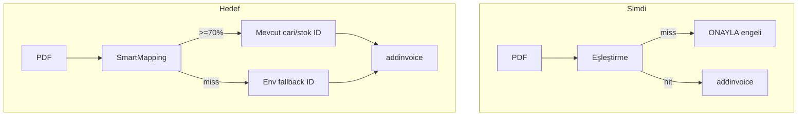

# Smart Mapping mimari refactor

## Mevcut durum vs hedef

Kodda fuzzy eşleştirme **zaten var** ([`score.ts`](src/services/matching/score.ts) — Levenshtein + token overlap, eşik %75). Sorun strict matching değil; **eşleşme bulunamayınca ONAYLA bilerek engelleniyor** ([`handler.ts`](src/services/conversation/handler.ts) ~316, [`resolve-order.ts`](src/services/matching/resolve-order.ts) `buildBlockingErrors`).



**Politika değişikliği:** Eşleşme yoksa hata değil, varsayılan ID + uyarı. ONAYLA her zaman fişler (fallback env doluysa).

---

## Fix 1 — Smart Mapping modülü

Yeni dosya: [`src/services/matching/smart-mapping.ts`](src/services/matching/smart-mapping.ts)

Tek giriş noktası: `resolveSmartOrder(tenant, draft, options?)` — mevcut [`resolveOrderMappings`](src/services/matching/resolve-order.ts) yerine veya onun içinden çağrılır.

**Cari pipeline (sıra):**
1. DB `customer_mappings` ([`customer.ts`](src/services/matching/customer.ts))
2. Katalog exact: vergi no / telefon
3. **Fuzzy** tüm cari listesi (`CatalogCache.getCustomers`) — skor >= `FUZZY_MATCH_THRESHOLD` (default **70**)
4. **Fallback:** `BIZIMHESAP_FALLBACK_CUSTOMER_ID` env → `source: "fallback"`

**Ürün pipeline (satır başına):**
1. DB `product_mappings`
2. Gömülü kod eşleşmesi (`LA-031` in name — [`extract-codes.ts`](src/services/matching/extract-codes.ts))
3. **Fuzzy** tüm stok listesi (`CatalogCache.getProducts`)
4. **Fallback:** `BIZIMHESAP_FALLBACK_PRODUCT_ID` env → `source: "fallback"`, `invoiceLineNote` = fişteki orijinal ürün adı

Başarılı fuzzy eşleşmelerde mevcut auto-learn (`learnCustomerMapping` / `learnProductMapping`) korunur.

**Yeni bağımlılık yok** — fuse.js eklenmez; [`scoreNameMatch`](src/services/matching/score.ts) yeterli.

---

## Fix 2 — Eşik ve env yapılandırması

[`src/config/env.ts`](src/config/env.ts) + [`.env.example`](.env.example):

| Değişken | Açıklama |
|----------|----------|
| `FUZZY_MATCH_THRESHOLD` | Default `70` (mevcut `AUTO_MATCH_THRESHOLD=75` yerine env-driven) |
| `BIZIMHESAP_FALLBACK_CUSTOMER_ID` | Panelde oluşturulan "WhatsApp Gelen Fişleri" cari ID |
| `BIZIMHESAP_FALLBACK_PRODUCT_ID` | Panelde oluşturulan "Tanımsız WhatsApp Ürünü" stok ID |

[`score.ts`](src/services/matching/score.ts): `AUTO_MATCH_THRESHOLD` env'den okunur; suggestion eşiği `threshold - 20` kalır.

---

## Fix 3 — Blocking → Warning (ONAYLA her zaman devam)

[`resolve-order.ts`](src/services/matching/resolve-order.ts):
- `blockingErrors` kaldırılır veya boş kalır
- Yeni `mappingWarnings: MappingWarning[]` (ör. `"Cari varsayılan atandı: WhatsApp Gelen Fişleri"`, `"Ürün fallback: Lucatech LA-031..."`)

[`handler.ts`](src/services/conversation/handler.ts):
- ONAYLA öncesi `blockingErrors.length > 0` kontrolü **kaldırılır**
- `requireMappedIds: true` kalır — Smart Mapping her satıra ID atadığı için throw etmez
- `postAddInvoice` try/catch zaten var; ek olarak fallback kullanımını logla

[`outbound.ts`](src/services/whatsapp/outbound.ts) önizleme:
- `✓` yanında kaynak: `kayıtlı` / `fuzzy (%82)` / `varsayılan`
- Fallback satırlarda: `⚠ varsayılan stok — açıklamada: <orijinal ad>`

---

## Fix 4 — addinvoice payload (fallback satırları)

[`ResolvedProductLine`](src/services/matching/product.ts) genişlet:
- `source: "fallback"` eklenecek
- `invoiceLineNote?: string` — fallback üründe orijinal PDF adı

[`invoice.ts`](src/services/bizimhesap/invoice.ts) `InvoiceProductLineMeta`:
- `invoiceLineNote` → `details[].note` (Bizimhesap API destekliyor)
- Fallback üründe `productName` = katalogdaki kısa ad ("Tanımsız WhatsApp Ürünü"), `note` = uzun fiş adı

---

## Fix 5 — Kurulum dokümantasyonu

[`docs/BIZIMHESAP_SETUP.md`](docs/BIZIMHESAP_SETUP.md) yeni bölüm:

1. Bizimhesap panelinde cari oluştur: **WhatsApp Gelen Fişleri**
2. Stok kartı oluştur: **Tanımsız WhatsApp Ürünü**
3. Railway Variables:
   ```
   BIZIMHESAP_FALLBACK_CUSTOMER_ID=<cari-guid>
   BIZIMHESAP_FALLBACK_PRODUCT_ID=<stok-guid>
   FUZZY_MATCH_THRESHOLD=70
   ```
4. `npm run probe:catalog` ile ID'leri doğrula

---

## Fix 6 — Testler

- [`smart-mapping.test.ts`](src/services/matching/smart-mapping.test.ts): fuzzy hit (%70+), fallback cari/ürün, hiç eşleşme yok + fallback env
- [`invoice.test.ts`](src/services/bizimhesap/invoice.test.ts): fallback satırında `note` = orijinal ad
- Mevcut 20 test korunur

---

## Beklenen sonuç

| Senaryo | Önce | Sonra |
|---------|------|-------|
| "Kadir Kaya Ltd." ~ %80 benzer cari | Öneri / engel | Otomatik cari ID |
| "A3 Lastik" ~ benzer stok | Engel | Otomatik stok ID |
| Hiç eşleşme yok | ONAYLA reddedilir | Fallback ID + uyarı, fiş düşer |
| Bizimhesap API hatası | Mesaj | try/catch + kullanıcıya hata metni (mevcut) |

**Not:** Fallback env boşsa production startup'ta [`assertBizimhesapConfigForProduction`](src/config/env.ts) uyarı logu — fişleme yine denenecek ama ID yoksa addinvoice hata döner; kurulum checklist'te zorunlu işaretlenecek.
